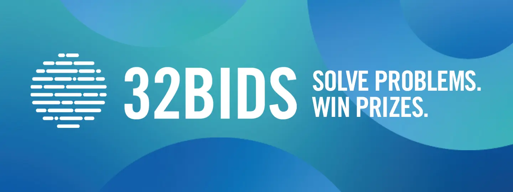

# 32BIDS_IMC

The 32bids coding challenge has been developed in collaboration with CambridgeSpark and consists of two rounds.   
In Round 1 there are four coding assignments that need to be completed. 
At the end of the first Round the top 128 contestants progress to Round 2.   
In Round 2 there are four coding assignments as well.   
The final results are based on Round 2 only. Round 1 is a qualification for Round 2.
At the end of Round 2, the winners were chosen. These were the 64 first places.

Start challenge: October 1st
End of 1st round: October 31st
End of 2nd round: November 22nd  

## Round 1:
- MidPrice
- QuoteTracking
- TwoStocks
- WorldIndex

## Round 2:
- Diversification
- OneMillion
- StockSymbol
